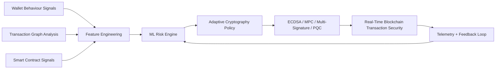

# Wageesha 

  

  

  
  
  

  
  
  

<table width="100%">
  <tr>
    <td width="62%" valign="top">
      <h2>Professional Summary</h2>
      

        I am <b>Wageesha Wishmitha</b>, a final-year undergraduate from <b>Sri Lanka</b> building premium, research-backed software across
        <b>AI Engineering</b>, <b>Machine Learning</b>, <b>Computer Vision</b>, <b>Data Analytics</b>, <b>Full Stack Development</b>,
        <b>Blockchain Security</b>, and <b>Cyber Security</b>.
      

      

        My work is shaped by one goal: ship systems that feel polished, are easy to use, and are strong enough to matter in the real world.
      

      <ul>
        <li><b>Current status:</b> Final Year Undergraduate</li>
        <li><b>Career direction:</b> AI, ML, Data Science, Software Engineering, Cyber Security</li>
        <li><b>Working style:</b> Research-aware, product-minded, security-conscious, and highly visual</li>
        <li><b>What I build:</b> Intelligent systems, dashboards, automation tools, and applied prototypes</li>
      </ul>
    </td>
    <td width="38%" valign="top" align="center">
      
    </td>
  </tr>
</table>

---

## Journey

- Started with curiosity about how software solves real problems.
- Expanded into full-stack development, analytics, and AI-powered systems.
- Moved toward security-aware thinking through blockchain security and cyber security interests.
- Built a final-year research direction around real-time security enhancement in blockchain-based transactions.
- Now focused on internships, graduate opportunities, and high-impact project work.

## Career Timeline

| Period | Focus | Outcome |
| --- | --- | --- |
| Foundation | Programming and problem solving | Strong base in Python, Java, JavaScript, C, C++, and SQL |
| University Build Phase | Full stack and applied projects | Portfolio of practical systems, AI tools, and dashboards |
| Research Phase | Blockchain security and adaptive cryptography | Final-year research with a real-time security focus |
| Career Launch | Internship and graduate preparation | Ready for AI, ML, software, and security opportunities |

## Education

- <b>Degree:</b> Computer Science undergraduate
- <b>Status:</b> Final year
- <b>Location:</b> Sri Lanka
- <b>Focus:</b> Building toward AI, security, and intelligent systems engineering

## Research Interests

  
  
  
  
  

- Machine Learning Risk Analysis
- Adaptive Cryptography
- Blockchain Security
- Smart Contract Analysis
- Wallet Behaviour Analysis
- Transaction Graph Analysis
- Feature Engineering
- ECDSA, MPC, Multi Signature, Post Quantum Cryptography
- Real-time Security

## Research Spotlight

<b>AI-Driven Adaptive Cryptography for Real-Time Security Enhancement in Blockchain-Based Digital Currency Transactions</b>

  A research-driven system that combines intelligence, transaction analysis, and security policy adaptation to strengthen blockchain-based currency flows in real time.

<table width="100%">
  <tr>
    <td width="48%" valign="top">
      <h4>Core Layers</h4>
      <ul>
        <li><b>Risk sensing:</b> ML-based behavioural and transaction analysis</li>
        <li><b>Decision layer:</b> Adaptive policy selection for stronger security controls</li>
        <li><b>Protection layer:</b> ECDSA, MPC, multi-signature, and post-quantum strategies</li>
        <li><b>Feedback loop:</b> Continuous improvement from real-time telemetry</li>
      </ul>
    </td>
    <td width="52%" valign="top">

    </td>
  </tr>
</table>

---

## Featured Projects

🏛️ <b>BOSS</b>

- <b>Short description:</b> A structured system for managing operations, workflows, and users with a clean product feel.
- <b>Technologies:</b> Full-stack web stack, APIs, SQL, JavaScript, HTML, CSS
- <b>Key features:</b> Modular flows, dashboard-style UI, data handling, role-aware design
- <b>Future improvements:</b> Advanced analytics, richer access control, better automation, mobile-first refinements

📊 <b>InsightLK</b>

- <b>Short description:</b> A data-focused platform for turning information into visual insight.
- <b>Technologies:</b> Python, SQL, data visualization, APIs, analytics tooling
- <b>Key features:</b> Metrics dashboards, data modelling, interactive insight views, structured reporting
- <b>Future improvements:</b> Predictive analytics, deeper filters, exportable reports, live refresh

👁️ <b>Face Recognition System</b>

- <b>Short description:</b> A computer vision project exploring face detection and recognition workflows.
- <b>Technologies:</b> Python, OpenCV, NumPy, scikit-learn, machine learning tooling
- <b>Key features:</b> Recognition pipeline, image processing, model experimentation, privacy-aware design
- <b>Future improvements:</b> Higher accuracy, model comparison, real-time capture, anti-spoofing checks

🔤 <b>Word Wanted</b>

- <b>Short description:</b> A smart utility built around language, learning, or content assistance.
- <b>Technologies:</b> JavaScript, Python, REST APIs, database-backed application patterns
- <b>Key features:</b> Clean UX, responsive interface, assisted interaction, structured content flow
- <b>Future improvements:</b> Smarter suggestions, personalization, history tracking, richer search

🏢 <b>Mental Breakdown eGov</b>

- <b>Short description:</b> A process-heavy digital government-style system with multi-step flow thinking.
- <b>Technologies:</b> HTML, CSS, JavaScript, backend services, SQL
- <b>Key features:</b> Role-based logic, multi-step workflows, state handling, administrative structure
- <b>Future improvements:</b> Notification system, audit trail, analytics, stronger form validation

✨ <b>Genies STK</b>

- <b>Short description:</b> A creative project combining intelligent behavior with structured software design.
- <b>Technologies:</b> Python, AI/ML tooling, APIs, data processing
- <b>Key features:</b> Intelligent interactions, configurable logic, responsive behavior, modular structure
- <b>Future improvements:</b> Better personalization, faster inference, improved UI polish, expanded integrations

🎓 <b>Examination Department</b>

- <b>Short description:</b> An academic administration system focused on scheduling, records, and structured access.
- <b>Technologies:</b> Web stack, SQL, forms, backend APIs
- <b>Key features:</b> Student-facing workflows, administrative views, clean data entry, organized outputs
- <b>Future improvements:</b> Notification module, report generation, role-based dashboards, export tools

🧾 <b>Attendance AI</b>

- <b>Short description:</b> An AI-assisted attendance concept built for automation and efficiency.
- <b>Technologies:</b> Python, OpenCV, AI/ML tooling, APIs, database support
- <b>Key features:</b> Recognition-driven capture, automated records, real-time logic, clean reporting
- <b>Future improvements:</b> Edge deployment, accuracy tuning, anti-fraud checks, analytics dashboard

💬 <b>Penix Chatbot</b>

- <b>Short description:</b> A conversational system designed to feel responsive, useful, and interactive.
- <b>Technologies:</b> Python, NLP tooling, REST APIs, database-backed conversation state
- <b>Key features:</b> Message handling, contextual flows, quick responses, easy-to-scan UI
- <b>Future improvements:</b> Better memory, richer intent handling, tool use, multimodal expansion

📈 <b>Social Media Analyzer</b>

- <b>Short description:</b> A data analysis project for turning social signals into useful insight.
- <b>Technologies:</b> Python, Pandas, NumPy, SQL, visualization tooling
- <b>Key features:</b> Trend analysis, structured datasets, visual output, report-friendly insights
- <b>Future improvements:</b> Sentiment analysis, real-time ingestion, sentiment dashboards, richer metrics

🩺 <b>Healthcare Assistant Bot</b>

- <b>Short description:</b> A supportive assistant concept focused on practical healthcare guidance and interaction.
- <b>Technologies:</b> Python, AI/ML tooling, APIs, data processing
- <b>Key features:</b> Guided responses, helpful flow design, clear interactions, structured input handling
- <b>Future improvements:</b> Better personalization, safer content filters, symptom triage, appointment support

💃 <b>Choreo AI</b>

- <b>Short description:</b> An AI-inspired creative project centered on movement, media, and intelligent generation.
- <b>Technologies:</b> Python, computer vision, AI/ML tooling, multimedia processing
- <b>Key features:</b> Motion-aware logic, intelligent output, creative interface, demo-friendly presentation
- <b>Future improvements:</b> Better pose intelligence, smoother media handling, style controls, live preview

---

## Tech Stack

<b>Programming</b>

  
  
  
  
  
  

<b>Frontend</b>

  
  
  
  
  
  

<b>Backend</b>

  
  
  
  

<b>Databases</b>

  
  
  
  
  
  

<b>AI / ML</b>

  
  
  
  
  
  
  
  

<b>Blockchain</b>

  
  
  
  

<b>Security</b>

  
  
  
  
  
  

<b>Tools</b>

  
  
  
  
  
  

## Skills Radar

| Domain | Level | Notes |
| --- | --- | --- |
| AI / ML | High | Computer vision, analytics, intelligent systems, research-driven experimentation |
| Full Stack | High | Responsive interfaces, APIs, data flow, product-style delivery |
| Security | Growing Strong | Blockchain security, cyber security tools, secure design thinking |
| Data | High | SQL, analysis, feature engineering, dashboards, insight building |
| Research | High | Adaptive cryptography, transaction analysis, applied problem framing |
| UI / UX | Strong | Clean layouts, visual hierarchy, minimal friction, polished presentation |

---

## GitHub Stats

  
  

  

  

  

  

  
  

## Professional Highlights

| Section | Snapshot |
| --- | --- |
| Achievements | Built a portfolio spanning AI, full stack, analytics, and security-aware applications |
| Certifications | Ready to list verified certifications as they are completed |
| Hackathons | Suitable space for team builds, prototypes, and competition outcomes |
| Open Source | Comfortable contributing, reviewing, documenting, and improving shared code |
| Leadership | Shows initiative through project ownership, problem framing, and delivery |
| Community | Open to collaboration, peer learning, and knowledge exchange |
| Experience | Hands-on experience from university projects, research, and self-directed builds |
| Services | AI prototypes, full-stack systems, data dashboards, and security-focused tooling |
| Publications | Reserved for papers, posters, or preprints when available |

## Current Learning

- Advanced AI and ML workflows
- Computer vision and model evaluation
- Data analytics and feature engineering
- Blockchain security and cryptography
- Secure systems thinking and practical cyber security tooling

## Future Goals

- Secure an internship or graduate role aligned with AI, ML, software, or security
- Move from prototype-level builds to production-quality systems
- Publish stronger research outputs and present them professionally
- Build intelligent systems that are visually polished and technically reliable

## Favourite Quote

> Build systems that are useful, trustworthy, and hard to forget.

## Random Dev Quote

> Simplicity scales only when it is backed by discipline.

## Support Me

  
  

## Contact Me

  
  

## Fun Facts

- I like projects that combine logic, visual polish, and real utility.
- I naturally gravitate toward systems with data, structure, and measurable impact.
- I prefer building something useful over making something merely large.

## Outside Coding

- Learning new tools and ideas
- Exploring design, systems, and security
- Turning ideas into projects that feel professional

## Coding Philosophy

- Ship with clarity.
- Design for maintainability.
- Treat security as a feature, not an afterthought.
- Build for humans first, then optimize for scale.

## Daily Workflow

| Step | What it looks like |
| --- | --- |
| 1 | Review the goal and break it into small tasks |
| 2 | Build the core path first |
| 3 | Add structure, polish, and validation |
| 4 | Check edge cases and improve UX |
| 5 | Refactor until it feels clean and maintainable |

## My Development Environment

| Area | Stack |
| --- | --- |
| Editor | VS Code |
| Version Control | Git, GitHub |
| API Testing | Postman |
| Containerization | Docker |
| Design | Figma |
| Security Tools | Wireshark, Burp Suite, Nmap, Metasploit |
| Primary OS | Linux, Windows |

## Languages I Speak

- English
- Sinhala

## Music While Coding

- Lo-fi beats
- Soft instrumentals
- Focus playlists

## Current Focus

- AI engineering with real-world utility
- ML systems that are measurable and explainable
- Security-aware development across apps and research
- Strong internship and graduate readiness

## 2026 Goals

- Secure an internship or graduate role aligned with AI, ML, software, or security
- Polish the portfolio into a stronger research-and-product showcase
- Publish or present final-year research effectively
- Ship at least one standout project with a premium user experience

## 2027 Goals

- Grow into a stronger engineer who can build and defend intelligent systems
- Deepen expertise in AI, secure systems, and applied research
- Contribute more confidently to teams, communities, and open-source work

---

  <i>If this profile feels like a portfolio, that is the point.</i>

  

